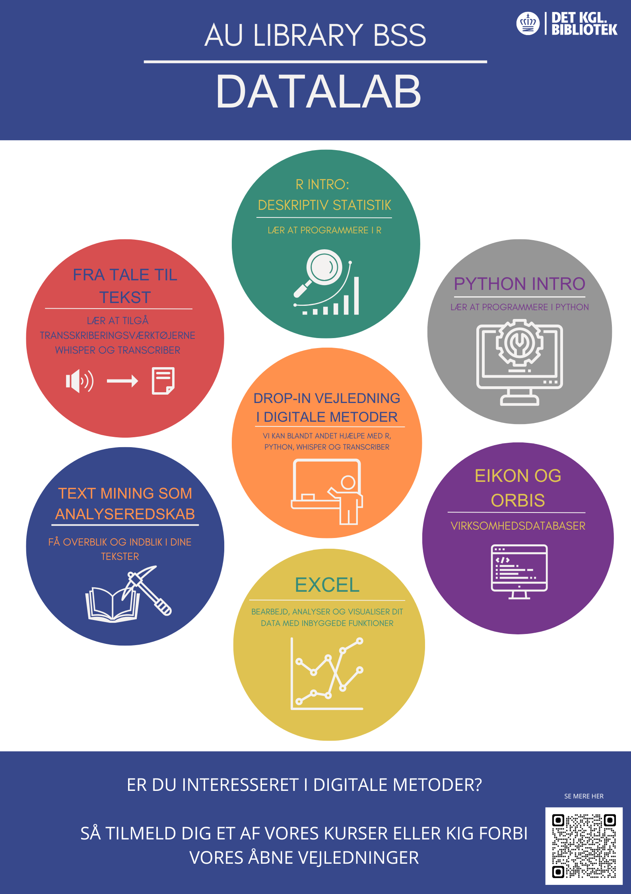

# Hvad er BSS Datalab?

Hos BSS Datalab kan alle BSS-studerende få hjælp til arbejdet med de data, der indgår i deres fag. Uanset om du arbejder med finansielle data, interviews, API-kald eller noget helt fjerde, står vi klar til at assistere dig.

Få f.eks. hjælp til opbygning af datasæt, Excel, Nvivo, R, Python og andre værktøjer. Vi kan eksempelvis hjælpe med at udtrække, rense og organisere dine data samt vejlede i forhold til det videre arbejde med forskellige analyseværktøjer. 

# Hvordan bruger du BSS Datalab?

Du kan bruge BSS Datalab ved enten at tilmelde dig et kursus eller møde op til en af vores åbne workshops.

Har du brug for mere specifik hjælp til et dataproblem, kan du også booke en bestemt medarbejder, der kan hjælpe dig videre. 

Find kurser i BSS Datalabs kalender ved at følge dette link: https://aulkalender.kb.dk/calendar/aulibrary?cid=6951&t=d&d=0000-00-00&cal=6951&ct=35964&inc=0
eller ved at scanne QR koden på nedenstående billede

