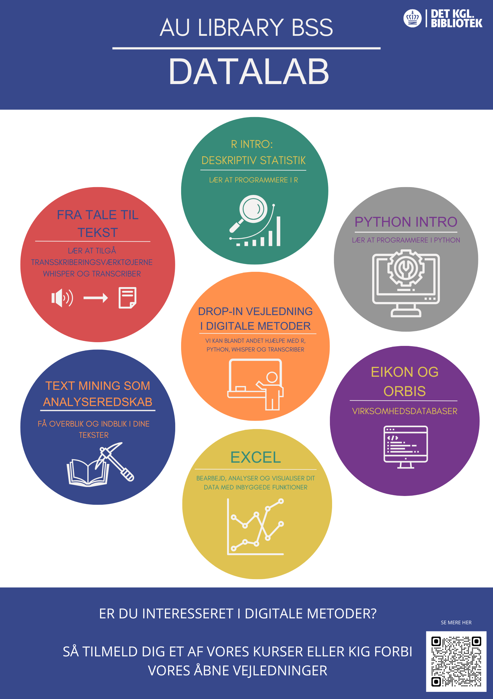

# Hvad er BSS Datalab?

Hos BSS Datalab kan alle BSS-studerende få hjælp til arbejdet med de data, der indgår i deres fag. Uanset om du arbejder med finansielle data, interviews, API-kald eller noget helt fjerde, står vi klar til at assistere dig.

Få f.eks. hjælp til opbygning af datasæt, Excel, Nvivo, R, Python og andre værktøjer. Vi kan eksempelvis hjælpe med at udtrække, rense og organisere dine data samt vejlede i forhold til det videre arbejde med forskellige analyseværktøjer. 

Se vores repositorier nederst på denne side. Disse indeholder materiale fra vores forskellige workshops.

# Hvordan bruger du BSS Datalab?

Du kan bruge BSS Datalab ved enten at tilmelde dig et kursus eller møde op til en af vores åbne workshops.

Har du brug for mere specifik hjælp til et dataproblem, kan du også booke en bestemt medarbejder, der kan hjælpe dig videre. 

Find kurser i BSS Datalabs kalender ved at følge dette link: https://aulkalender.kb.dk/calendar/aulibrary?cid=6951&t=d&d=0000-00-00&cal=6951&ct=35964&inc=0
eller ved at scanne QR koden på nedenstående billede

# What is BSS Datalab?
BSS Datalab can help all BSS students working with the data included in their courses. Whether you work with financial data, interviews, API calls or something completely different, we are ready to assist you.

Get help with building datasets, Excel, Nvivo, R, Python and other tools. For example, we can help you extract, clean and organise your data, and we can also provide guidance in relation to further work with various analysis tools.

Check out our reposities below this page. These contains material from our different workshops.

# How do you use BSS Datalab?
You can use the BSS DataLab either by signing up for a course or by attending one of our open workshops. If you need more specific help with a data issue you can also book a specific employee who can help you. 
Find courses in the BSS DataLab calendar: https://aulkalender.kb.dk/calendar/aulibrary?cid=6951&t=d&d=0000-00-00&cal=6951&ct=35964&inc=0
